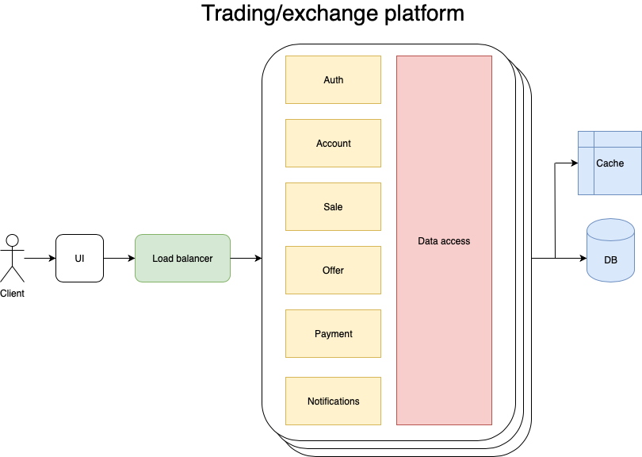

Exchanger is a platform for trading goods for cross-platform currency -- Koins.

#### Idea
The idea of the project is that simple: user can put up for sale its goods to the exchange platform with start price. Other users can offer its own prices. The seller will accepts one of the offers. After that user whose offer has been accepted will get the opportunity to pay for the good with Koin (in-platform currency) and finish the deal.

#### Architecture
Current architecture scheme is monolithic for now and looks like that:

It is going to be broken into microservices architecture in future commits.

#### Project structure
It is monolith written in Kotlin. Server-side is based on [Ktor](https://github.com/ktorio/ktor) framework. Client-side is a react-js app compiled from Kotlin. Database is embedded for now.

#### For now implemented endpoints
 * `GET "/"`
 * `POST/GET "/login"`
 * `POST "/register"`
 * `POST "/logout"`

#### How to run
* Create and run docker images using command: `docker-compose up -d`. This will run web and backend containers.

This will start the app in browser on `localhost:8080`

